# Cal Engine

To simply run the `cal-engine`:

```
make it-rain
```

Build the `cal-engine` image:

```
make cal-engine
```

Use Docker Compose to deploy the cal-engine along with zipkins and database:

```
make up
```

To see logging:

```
make logs
```

Destroy everything:

```
make down
```


# Folder Structure

## app

App layer, it's at the top, hold all the code that represents the application level concerns

requests, responses, CLI tooling, UI/UX related code

## business

contains all the business level concerns, represents the problem this project is trying to solve, what is the purpose of the project

solving all the business rules, talking to databases or external systems, and data modeling that goes on at the business layer

## foundation

it's code that is not business-oriented, business-oriented code is going to be very specific to the one problem or the problem this project is solving. The business layer code probably is not reusable across multiple projects. If there is a business-layer package, that is potentially reusable in a different project, I would wonder why that project exists, why isn't those apps being moved to this project.

Not logging here

# Help

```shell
./cal-engine --help
./cal-engine -v
```

# Monitoring

https://stackoverflow.com/questions/36650052/golang-equivalent-of-npm-install-g

```shell
expvarmon -ports=":4000" -vars="build,requests,goroutines,errors,mem:memstats.Alloc"
```

Logging
Error Handling
Metrics
Panic Handling
Authentication
Readiness (center)
Authentication
Panic Handling
Metrics
Error Handling
Logging

# Error Handling

Handling an error means 3 things:

1. the error stops with the code that is going to handle it, so that the error won't propagate anymore back up the call stack
2. the error is going to be logged with the full context and we totally log once
3. a decision has to be made on whether or not this app should be shut down or integrity can be restored and we can keep going

The big problem here is that the error has to be logged with full context, which means that "foundation" code can't handle errors, whether we like it or not, because "foundation" code can't log. But business layer can handle errors and application layer code can absolutely handle errors. And any layer can signal a request to shut down. 

Now, the idea that the error can only be logged once does create some mechanical issues if you want to capture the full call path of an error, like its origin or in terms of what line of code it's on and then extra context that goes up.

One of the things we need to be able to do with error handling is we'll be able to wrap it up with contextual information. Now there's a couple of ways we can do that in Go:

There's recent support in the stand library with the `fmt` package, the `errorf` function, and the `errors` package has `Is` and `As` functions. According to Bill Kennedy, he thinks the standard library is causing more confusions than good, and he doesn't think it has a clean and clear API. So he suggests to use the [errors](https://golang.org/pkg/errors/) package instead.

When it comes to wrapping errors, the foundational layer shouldn't be wrapping errors, because error wrapping is more like a policy, and we should treat the foundational layer as more like the standard library, it can return root error values, but doesn't necessarily need to wrap as an extra context.

If you ask Rob Pike what an error is in Go, he'll tell you errors are just values, they can be anything you need them to be, both state- and behavior-wise. And it makes sense because it's the error interface that we use as the return type that defines how all different functions that should be returning errors.

Along with that, Goland enforces the idea that you have to check the error immediately after the function call, so that everything stays in context, you know, majority of the engineering we do should be about failures, not about when life is good.

Keeping in mind that errors in Go are just values,w e should start thinking about the idea of signaling with values as related to error handling. We have signaling semantic in the Go language as related to `channel`s. When we think about channel signaling, we are talking about signaling as occur in between two or more goroutines. Channel signaling or Goroutine signaling is what we would call "horizontal signaling". 


When we think about error handling as signaling as well, but it's not horizontal signaling, it's more as vertical signaling. When we make function calls, there's a call stack where each function has their own boundaries in their stack frame, now let's say that `Function 6` has an error, and `Function 6` reports that back to the call stack, `Function 5`'s job is to validate if `Function 6` causes an error or not, and now we'll have to make an decision, that if the error does exist, how are we going to handle it? And by handling it means we can log it or do other things too.

Remember we use the error interface, and the error interface is literally a way of decoupling the concrete value, so it's not based on what it is, but based on what we can do. So we can see the error interface as constructing a pipe that lets us signal errors, but not horizontally, but "signal" errors up the call stack when there's a problem:

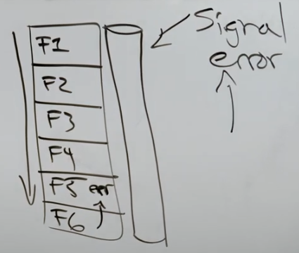

And because it's an interface, and because errors in Go are just values, so when `Function 6` returns an error, it's returning a concrete value through this pipe, that value can be anything, in other words, we can have different error values that represent different signals around what errors occurred and how critical those errors can be. When we think about this in terms of signaling, then those error values represent different signals of different priorities or importance, or integrity, etc:

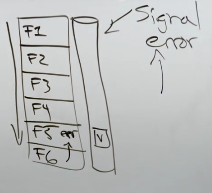

What we can do then is imagine `Function 6` here is actually signaling the error back through the error interface, in this case, it's putting a root error value, and then at `Function 5`, it says "Look, I see that `Function 6` failed because there's a concrete value stored inside the error interface." And let's say now `Function 5` says "I'm not gonna handle this error because I can't log", what should happen next?

Let's say `Function 5` and `Function 6` belong to the foundational layer, `Function 3` and `Function 4` are business related, and `Function 1` and `Function 2` are functions at the application layer. Since `Function 5` can't handle the error, the only thing it can do now is "signal" the error back up the call stack, but it can not only "signal" the error back, it can add context to it, like line information and any other application context, so what `Function 5` can do is wrap the root error value with some context, both application and call stack, and then send that error up the call stack, signaling it back up to `Function 4`. Now, `Function 4` checks to see if there's a concrete error, i.e. a concrete value in the error interface, the answer is yes, so `Function 4` gets to decide if it can handle the error and if so, if it's going to handle it. `Function 4` is at the business layer, so it can handle it, but let's say it decides not to handle it, so its job now becomes wrapping it with context and then send it back up the pipe. Let's say now the error interface is at `Function 2`, and it finally decides to handle it, so it logs it, and it decides if it wants to "signal" the error up the pipe, or shut down, or just keep going. And when `Function 2` logs it, it can log down every layer of context that was applied:

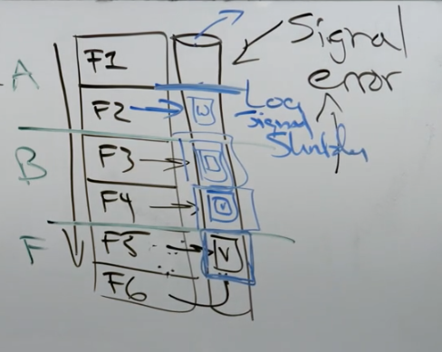

And with this mechanics, the usage of the `errors` package makes sense, because it has a function `Wrap` which is nice and simple that can wrap the context, unlike the standard library that is going to make you do a `fmt.Errorf`, with a `%w` verb, and it can get messy, not to mention we can potentially change out the root error value if we are not careful, of course we don't want this to happen, we want to keep the root error value to be at the core of the error. The `errors` package also has a function called `Cause`. Instead of `As` and `Is`, `Cause` gets us back to the root error value, and then we can apply our basic error mechanics.

Now the remaining question would be if these error values should be belong to `business` or `foundational` layers. This is actually a grey area and there is not a single particular right answer.

If we put them in the `foundational` layer, these can become more of a policy across the whole project or the same for all the people who use the `foundational` packages, which is nice, because you can get more consistency. 

If we put them in the `business` layer instead, we are only tying the error values to the project and the project only, with the assumption of the `foundational` packages eventually get to kit.

## Data Types

```go
// FieldError is used to indicate an error with a specific request field.
type FieldError struct {
	Field string `json:"field"`
	Error string `json:"error"`
}

// ErrorResponse is the form used for API responses from failures in the API.
type ErrorResponse struct {
    Error  string `json:"error"`
    Fields string `json:"fields,omitempty"`
}
```

One of the things we need to do is data validation when it comes to our web API, bad data in, bad data out, so what this `FieldError` data type is doing is as long as we record data validation issues at a field level (we will see this when we build out the business logic for the APIs).

The other thing that we need is a very consistent error response that we are going to marshal back to client. And the last thing that we want is depending on the API, the caller is getting a different `ErrorResponse`, so this is what can be expected for all the applications that consume from this project in terms of a error response, which is a string for the error information and a set of field errors for data validation.

```go
// RequestError is used to pass an error during the request through the
// application with web specific context.
type RequestError struct {
    Err    error
    Status int
    Fields error
}

// NewRequestError wraps a provided error with an HTTP status code. This
// function should be used when handlers encounter expected errors.
func NewRequestError(err error, status int) error {
    return &RequestError{err, status, nil}
}

// Error implements the error interface. It uses the default message of the
// wrapped error. This is what will be shown in the services' logs.
func (err *RequestError) Error() string {
    return err.Err.Error()
}
```

Now these are not error types, these are not going to be our error value signals, `FieldError` is just support for field errors and `ErrorResponse` is a type for sending a response. `RequestError` is what we are using as our error signal, and we are going to call this our trusted error signal. In other words, we have to have an idea about if an error is trusted or not trusted. Trusted for what? Trusted where the messaging behind the error is something that we trust, it can be sent across the wire back to the caller, that we are not giving up any privacy, or things that we should not have given up. For instance, we are not supposed to show database queries, because people can use that to do SQL injection on the application now as they know how the query looks like and how the application substitutes it.

Therefore, we are going to call `ErrorResponse` as a trusted application error, and any error messaging related to this error we are going to blindly send back to the client, so we are going to have to do some due-diligence during development. We have to do that because if we don't give client some form of messaging on certain errors, they can't correct what they are doing, they are blind.

So looking at `ErrorResponse`, we have `Err` which has the message, and we'd want to log what HTTP status we're using when we send the response, and then `Fields` which contains a set of fields to record errors for data validation.

It's not an error value until we implement the error interface, so we have a factory method and a `Error` method.

Normally, if we have a type like a error with these exported fields we wouldn't have a factory method because there is no value in doing so. If a user can construct a error type on their own without any misuse or fraud then do it. However, a lot of these errors are constructed at the return statements, so it's nice to have this factory function as a way to construct a error in a single line of code, and help for better readability of our code. 

## Shutdown

```go
// shutdown is a type used to help with the graceful termination of the service.
type shutdown struct {
    Message string
}

// NewShutdownError returns an error that causes the framework to signal
// a graceful shutdown.
func NewShutdownError(message string) error {
    return &shutdown{message}
}

// Error is the implementation of the error interface.
func (s *shutdown) Error() string {
    return s.Message
}

// IsShutdown checks to see if the shutdown error is contained
// in the specified error value.
func IsShutdown(err error) bool {
    if _, ok := errors.Cause(err).(*shutdown); ok {
        return true
    }
    return false
}
```

There's a second type of error we might be signaling, and that's the `shutdown` error value. We're going to send this error value up the error pipeline when we want to signal a shutdown. No code is allowed to directly shut down the application, that is bad, there has to be some checks and bounds. And just like our trusted error, `shutdown` also has a factory method and implements the `Error` interface.

We also have a function `IsShutdown` to validate if the root error value stored inside the error interface is a pointer to a shutdown. That's where the `Cause` comes in, it lets us say what is the root error value and the potential multi-layered wrapped context here and check if it's a shutdown or not.

## Push to ACS

Use the following steps to authenticate and push an image to your repository. 

1. Retrieve an authentication token and authenticate your Docker client to your registry. 
   
Use the AWS CLI:

```shell
aws ecr get-login-password --region ap-southeast-1 | docker login --username AWS --password-stdin 938897780349.dkr.ecr.ap-southeast-1.amazonaws.com
```

Note: If you receive an error using the AWS CLI, make sure that you have the latest version of the AWS CLI and Docker installed.

2. Build your Docker image using the following command. For information on building a Docker file from scratch see the instructions [here](http://docs.aws.amazon.com/AmazonECS/latest/developerguide/docker-basics.html). You can skip this step if your image is already built:

```shell
docker build -t cal-engine-amd64 .
```

3. After the build completes, tag your image so you can push the image to this repository:

```shell
docker tag cal-engine-amd64:latest 938897780349.dkr.ecr.ap-southeast-1.amazonaws.com/cal-engine-amd64:latest
```

You might have to change the tag depending on the image name and tag on your computer.

4. Run the following command to push this image to your newly created AWS repository:

```shell
docker push 938897780349.dkr.ecr.ap-southeast-1.amazonaws.com/cal-engine-amd64:latest
```

## Deployment to ECS

### Step 1: Create Cluster

Head to the ECS page and find the `Clusters` page:

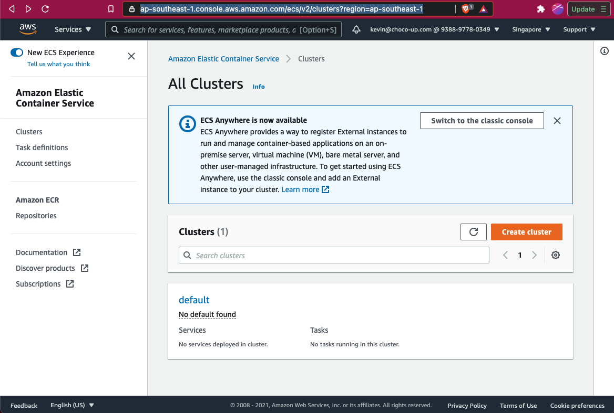

Click `Create Cluster` and choose `EC2 Linus + Networking`:

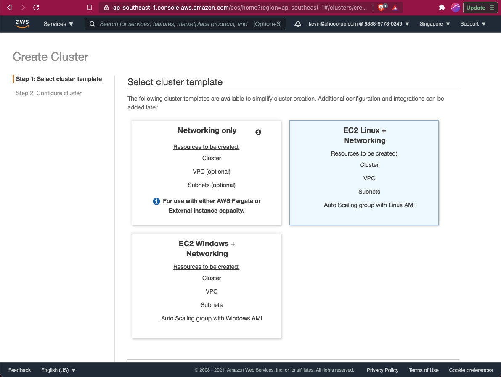

Use the following configurations:

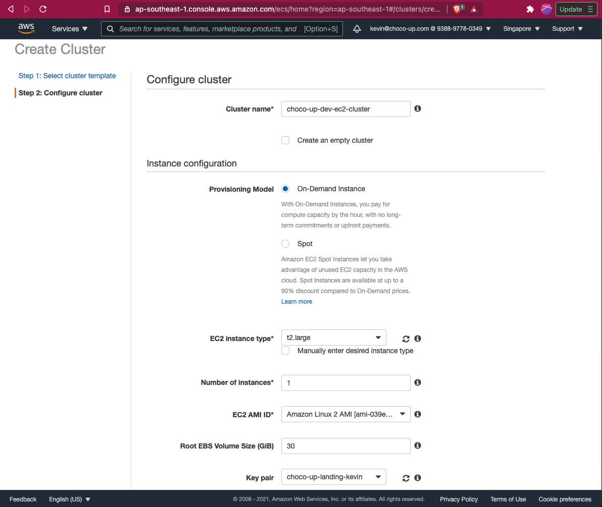

Mostly the default settings were used, except

- the `EC2 Instance Type` was changed to `t2.large`
- `Key Pair` was changed to `choco-up-landing-kevin`, which is the key pair I previously retrieved from setting up Choco Up WordPress landing page on an EC2 instance.

For the Networking section, we'll just create a security group and configure it later.

Click `Create` and we are good to go:

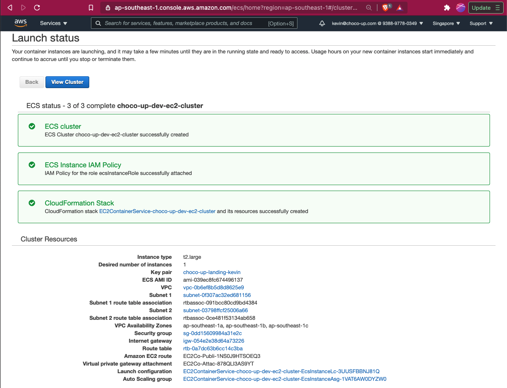

### Step 2: Create Task Definition

Click on the `Task Definition` page and click `Create new Task Definition`:

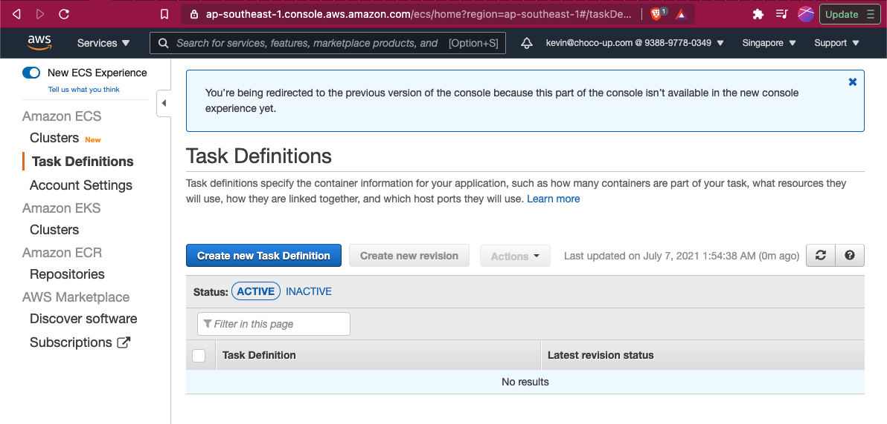

Choose `EC2` and click `Next step:

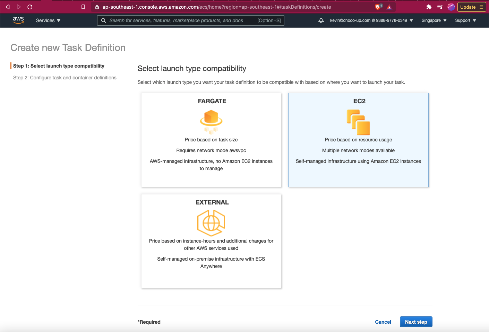

Fill in the following details in the creation page:

In the first section:

- Task Definition Name: `cal-engine-server`
- Task Role: `ecsTaskExecutionRole`
- Network Mode: `default`

In the Task execution IAM role section:

- Task execution role: `ecsTaskExecutionRole`

In the Task size section:

- Task memory (MiB): 512
- Task CPU (unit): 512

In the Container Definitions section, click `Add container` and fill in the following details:

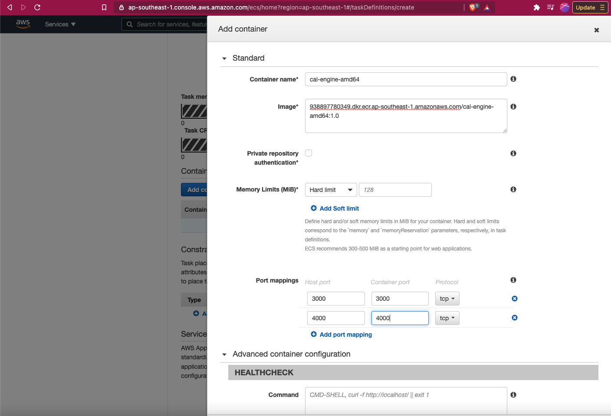

And then in the `STORAGE AND LOGGING` section, enable CloudWatch Logs:

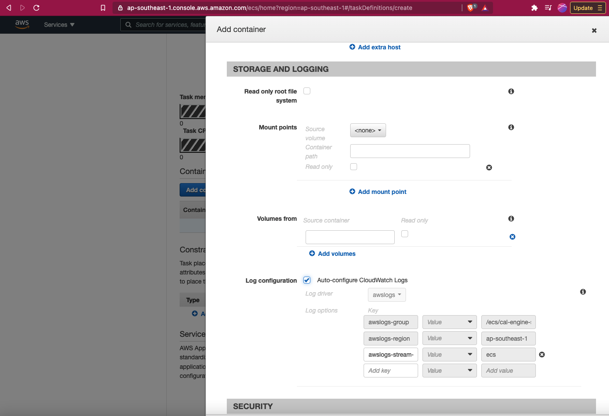

Click `Add`, which should bring you back to the creation page, click `Create`.

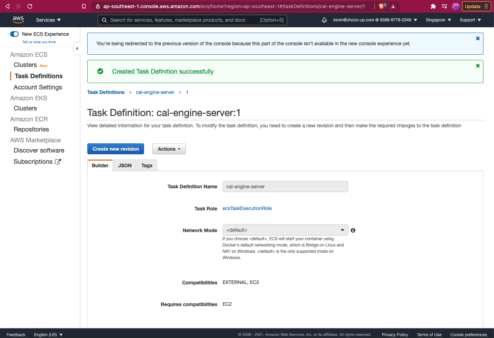

### Step 3: Create Service

A service lets you specify how many copies of your task definition to run and maintain in a cluster….Amazon ECS maintains that number of tasks and coordinates task scheduling with the load balancer.

Go back to the Cluster page and under the Services tab, click `Deploy`:

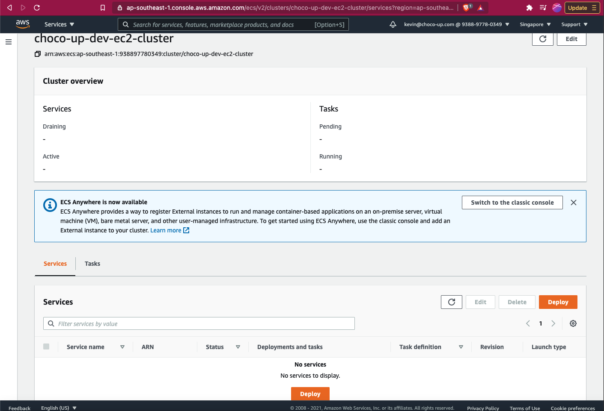

In the Deploy page, the in Environment section, expand `Compute configuration (advanced)`, and then in the `Launch type`, choose `EC2:

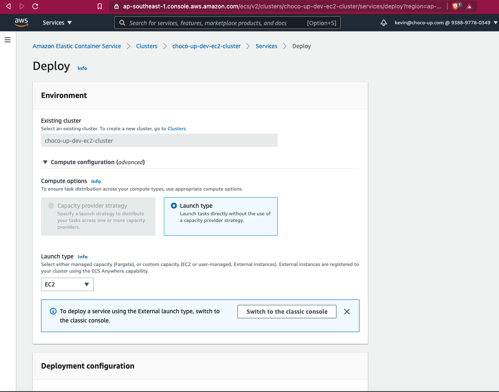

And then in the `Deployment configuration` section:


Leave the others as their defaults and click `Deploy`.

At this point, if you are experiencing problems like this:

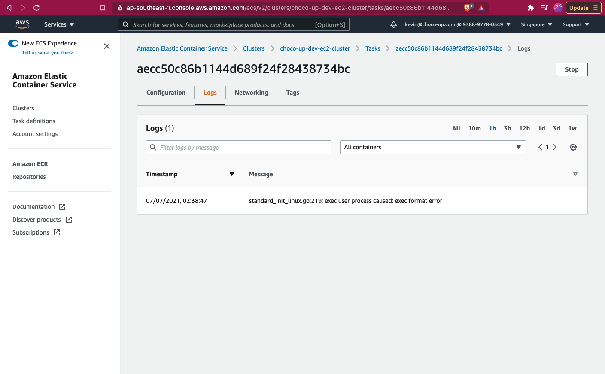

This is very likely due to you using the Macbook's M1 chip to build the Docker images ([reference](https://stackoverflow.com/questions/67361936/exec-user-process-caused-exec-format-error-in-aws-fargate-service)) and you are using the Mac version of Docker. Try reinstalling [Docker Desktop for Apple Silicon](https://docs.docker.com/docker-for-mac/apple-silicon/) instead ([reference](https://forums.docker.com/t/is-this-for-real-run-x86-docker-images-on-m1/103599)).

And then look at this article on how to build Docker images in x86 using the M1 Chip: https://blog.jaimyn.dev/how-to-build-multi-architecture-docker-images-on-an-m1-mac/

AWS References:

- https://medium.com/swlh/how-to-deploy-an-application-to-aws-using-docker-ecs-and-ecr-aa7785fc9667
- https://blog.clairvoyantsoft.com/deploy-and-run-docker-images-on-aws-ecs-85a17a073281
